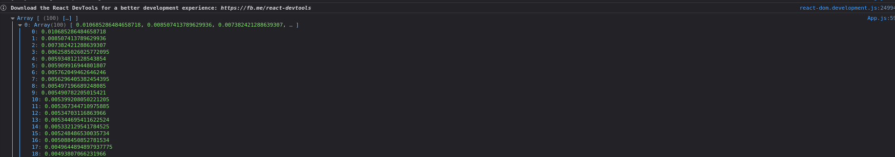
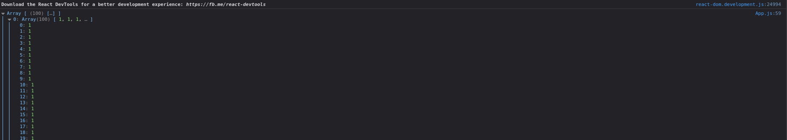
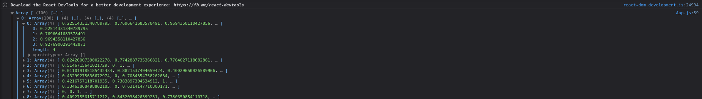
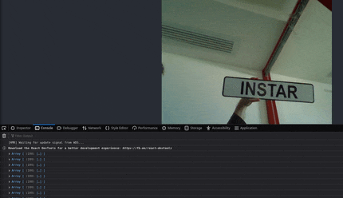

# Tensorflow Object Detection React Application

This template app can be used for real time object detection by leveraging the Tensorflow Object Detection API, React and Tensorflow JS. In order to leverage this template, first walk through the [Tensorflow Object Detection Course available on YouTube](https://www.youtube.com/c/nicholasrenotte). Complete the Notebook up to Step 11. Conversion to TFJS.

## Steps

* __Step 1.__ Clone this repository: https://github.com/mpolinowski/tensorflow-js-react-app
* __Step 2.__ Install Node https://nodejs.org/en/
* __Step 3.__ Install App Depdendencies `npm install`
* __Step 4.__ Copy your [exported Tensorflow.js model](https://mpolinowski.github.io/devnotes/2021-11-11--tensorflow-crash-course-part-iv) to `public/model`:


```bash
ls -la public/model

   4096 Jan  8 22:11 .
   4096 Jan  8 22:11 ..
4194304 Jan  8 20:54 group1-shard1of3.bin
4194304 Jan  8 20:54 group1-shard2of3.bin
3356824 Jan  8 20:54 group1-shard3of3.bin
 467951 Jan  8 20:54 model.json
```

* __Step 5.__ Link the model into your `src/App.js`:

```bash
const net = await tf.loadGraphModel('http://localhost:3000/model/model.json')
```

__Note__ this only works when you access the App via `http://localhost:3000/`. You can replace `localhost` with the IP address of your machine - but you will get an CORS Error if you try to access it. The _clean_ solution would be to stash your model on a server where you can adjust the webserver to allow resources from different IPs (this path is described in the Youtube video linked above). But this way is good enough for testing.


* __Step 6.__ Fix the bounding box - see [Github Issue](https://github.com/nicknochnack/TFODApp/issues/1)
* __Step 7.__ Run the App `npm start`
* __Step 8.__ The Tensorflow detection returns an Object that contains a lot of different data. Find the correct one by incrementing `console.log(await obj[0].array())` in `src/App.js` and check the output:


For me the position was `1` for __confidence scores__, `2` for __object classes__ and `4` for the corner position of the __boundary box__ - adjust these values accordingly in `src/App.js`


```bash
const boxes = await obj[3].array()
const classes = await obj[1].array()
const scores = await obj[0].array()
```

__Scores__



__Classes__



__Boxes__




## Workbox Issue

The Workbox service worker that ships with Create React App overrides the consol.log() output. Simply unregister the SW in your browser and reload the page to get rid of it:


```bash
Console -> Application tab -> Service workers -> sw.js unregister
```

## Test your Object Detection

